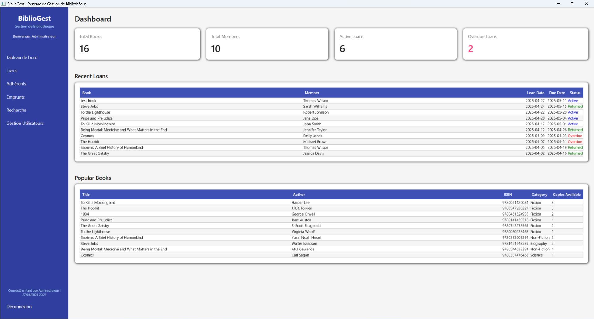
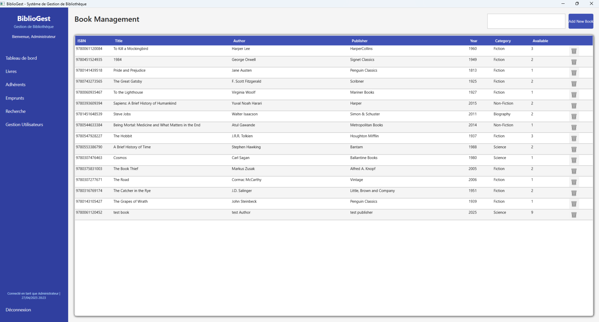
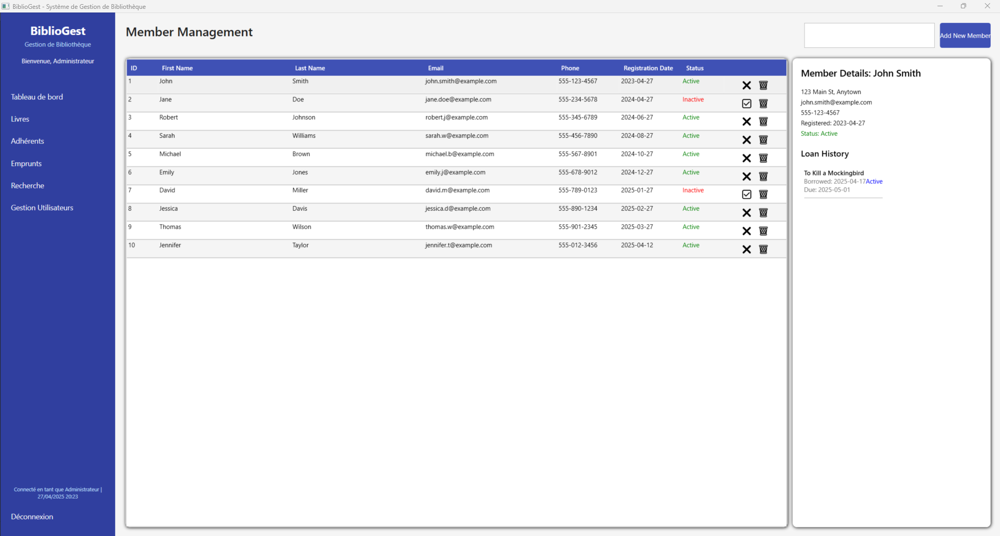
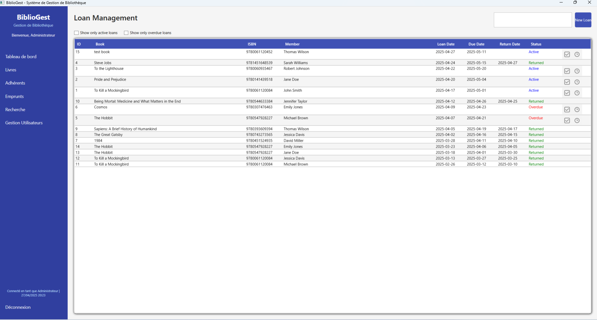
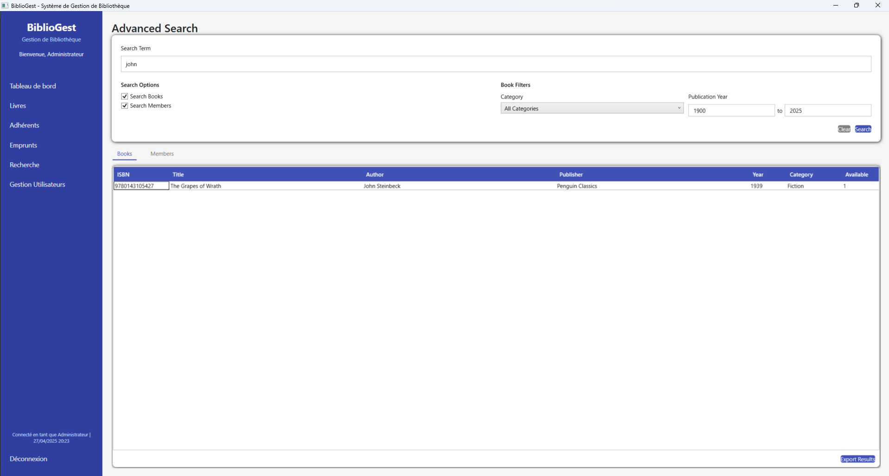
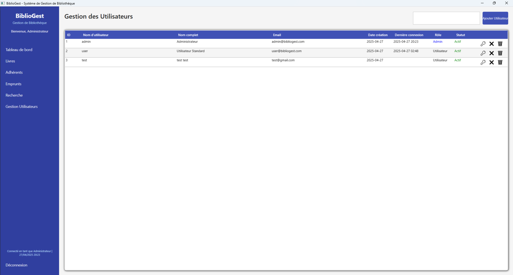
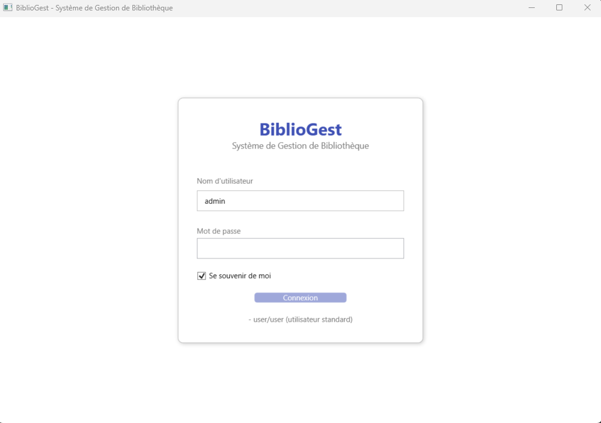
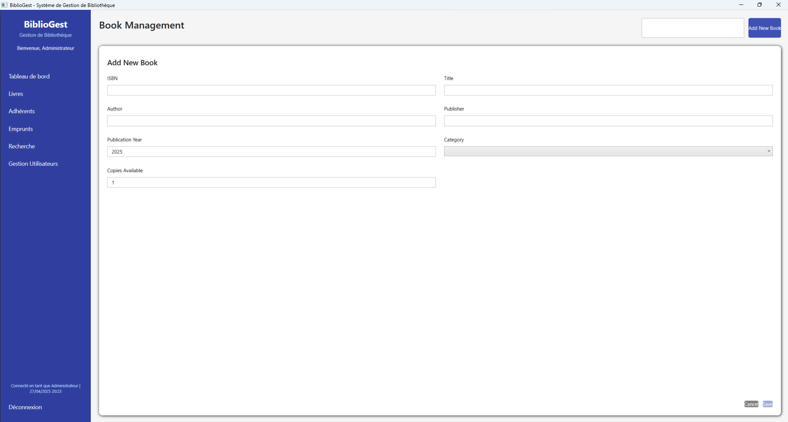
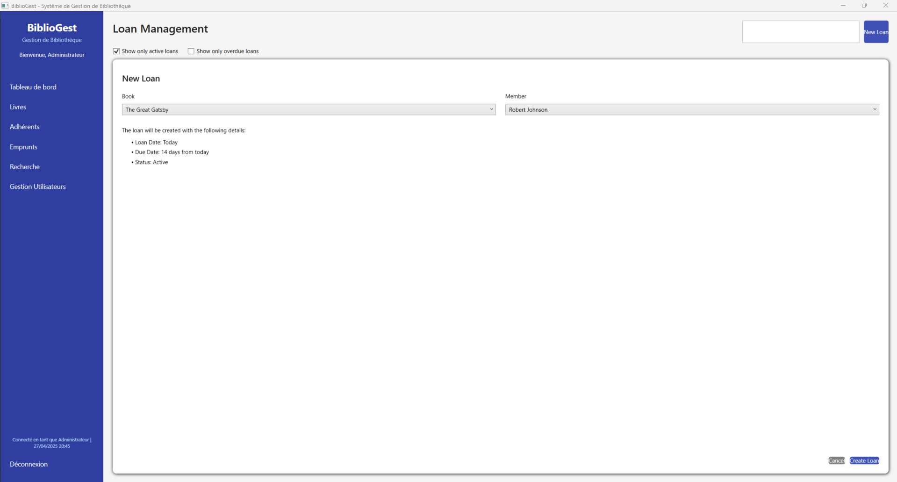

# BiblioGest - Library Management System

BiblioGest is a comprehensive library management system built with WPF and .NET 9.0, designed to help libraries efficiently manage their books, members, and loan operations.

## Features

### User Authentication
- Secure login system with role-based access control
- Administrator and regular staff user roles
- Password encryption using SHA256 with salt
- Remember me functionality for easier access

### Dashboard
- Overview of key metrics: total books, members, active loans, and overdue loans
- Recent loan activity display
- Popular books listing based on loan history



### Book Management
- Complete book inventory management
- Add, edit, and delete book records
- Categorization system with predefined categories
- Track availability status and number of copies
- Search and filter functionality



### Member Management
- Comprehensive member database
- Add, edit, and delete member profiles
- Track member registration date and status
- View member loan history
- Search members by name, email, or phone



### Loan Management
- Issue books to members with automatic due date calculation
- Track active, returned, and overdue loans
- Return processing with availability updates
- Loan extension functionality
- Filter and search loan records



### Advanced Search
- Combined search across books and members
- Filter books by category and publication year
- Export search results to CSV format



### User Administration (Admin Only)
- User account management
- Create, edit, and delete user accounts
- Reset passwords
- Activate/deactivate user accounts
- Assign administrator privileges



## Technical Details

### Architecture
- MVVM (Model-View-ViewModel) architecture pattern
- Clean separation of UI, business logic, and data access

### Technology Stack
- .NET 9.0 Framework
- WPF (Windows Presentation Foundation)
- Entity Framework Core 9.0.4
- SQLite database

### Database Schema
- Books: Stores book information including title, author, ISBN, and availability
- Members: Contains member details and status
- Loans: Tracks book lending, returns, and due dates
- Categories: Predefined categories for book organization
- Users: System user accounts with role information

### Data Storage
- Local SQLite database stored in user's AppData folder
- Automatic database creation and initialization

## Installation

1. Ensure you have .NET 9.0 SDK installed on your system
2. Clone the repository or download the source code
3. Open the solution in Visual Studio 2022 or later or Rider
4. Build the solution to restore NuGet packages
5. Run the application

## Default Login Credentials

The system is pre-configured with two default accounts:

- Administrator:
    - Username: admin
    - Password: admin

- Standard User:
    - Username: user
    - Password: user

It is highly recommended to change these passwords after first login.

## Development Notes

### Project Structure
- **Models**: Entity classes that represent database tables
- **ViewModels**: Contains the application logic and data binding
- **Views**: XAML UI definitions
- **Services**: Business logic implementations
- **Data**: Database context and migrations
- **Utilities**: Helper classes and utilities

### Building from Source
1. Clone the repository
2. Open the solution in Visual Studio
3. Restore NuGet packages
4. Build the solution

### Creating Migrations
If you modify the data model, you can create new migrations using:
```
dotnet ef migrations add [MigrationName]
```

And apply them with:
```
dotnet ef database update
```

## License

This project is licensed under the MIT License - see the LICENSE file for details.

## Acknowledgments

- Icons and graphics from [source]
- Inspired by the needs of small to medium-sized libraries

## Screenshot Gallery

### Login Screen



### Book Inventory

 

### Adding a New Member

 

### Processing a Loan

